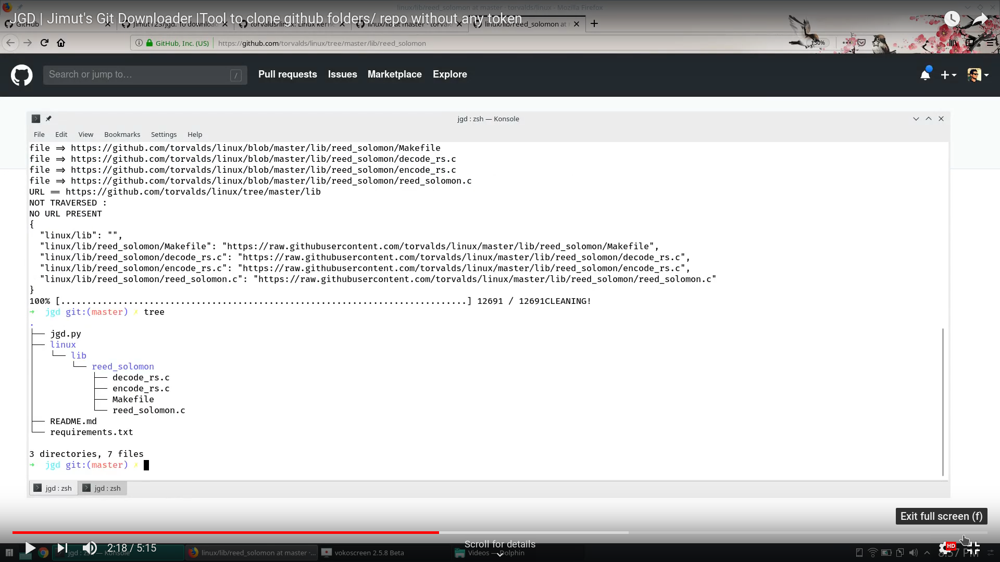

# JGD: Jimut's Git Downloader

[](https://zenodo.org/badge/latestdoi/183674017)
[](https://www.gnu.org/licenses/gpl-3.0) 


This program scraps and download every public repo present out there!
It doesn't uses auth/token. Useful when you just need to download files of a folder, and not the whole repo.


#### DEMOS:

<a href="https://www.youtube.com/watch?v=jq9o54D2ySo" alt="YT video" target="_blank"></a>

#### Installation

```
$ git clone https://github.com/Jimut123/jgd
$ cd jgd
$ sudo python setup.py install
$ jgd -h
usage: jgd [-h] url

positional arguments:
  url         URL is mandatory! Please provide URL to folder/repo of Public
              repository.

optional arguments:
  -h, --help  show this help message and exit

```


#### Pros:
* No need to download the whole repo, scrap it.
* Downloads files, folders 
* Doesn't uses any kind of token

#### Cons:
* Need to reclone it everytime the repo is updated, this is not GIT!


#### USAGE:
```
python jgd.py <any-git-folder-url>
python jgd.py <any-git-repo-url>
```
#### Install the requirements:
```
sudo pip install -r requirements.txt
```

## [LICENSE](https://github.com/Jimut123/jgd/edit/master/LICENSE)
```
 GNU GENERAL PUBLIC LICENSE
                       Version 3, 29 June 2007

 Copyright (C) 2019-20 Jimut Bahan Pal, <https://jimut123.github.io/>
 Everyone is permitted to copy and distribute verbatim copies
 of this license document, but changing it is not allowed.
```

#### Author:
* [Jimut Bahan Pal](https://jimut123.github.io)
